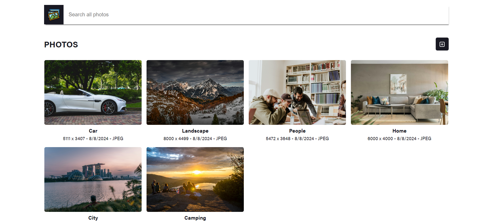

# MyGallery - Image Database React App



## Overview

This is a React application that serves as an image database using json-server for backend storage. Images are stored as blobs and are referenced within the application. The deployment is automated using Terraform, Azure Cloud services, and GitHub Actions.

[Presentation Video](presentation.mp4)

## Features

- **Image Storage:** Stores images as blobs and references them in a local JSON database.
- **Frontend:** Built with React, displaying images with their associated metadata (e.g., title, upload date).
- **Backend:** Uses json-server to simulate a REST API for storing image metadata.
- **Deployment:** Automated deployment using Terraform on Azure Cloud, integrated with GitHub Actions for CI/CD.

## Usage

### Prerequisites

- **Node.js and npm**
- **json-server (install via npm: `npm install -g json-server`)**
- Terraform (optional)
- Azure CLI (optional)
- GitHub account for CI/CD integration (optional)

### Installation

1. **Clone the repository:**

```sh
git clone https://github.com/tbtiberiu/mygallery.git
cd mygallery
```

2. **Install dependencies:**

```sh
npm install
```

3. **Start `json-server`:**

```sh
npm run serve
```

4. **Start the React app:**

```sh
npm run dev
```

5. **Access the application:**

- Open your browser and navigate to `http://localhost:5174`.

## Image Metadata Example

Images are stored with metadata in db.json like this:

```json
{
  "id": "5df7fc0c-8a58-4552-a3ec-490b31491444",
  "title": "Car",
  "image": "blob:http://localhost:5173/3b6ee083-0de5-426f-8ecb-5ea3913adb4e",
  "uploadDate": "8/8/2024",
  "type": "jpeg"
}
```
